### Escuela Colombiana de Ingeniería
### Arquitecturas de Software - ARSW
## Ejercicio Introducción al paralelismo - Hilos - Caso BlackListSearch

Nombres: Camilo Murcia Espinosa y Tomas Suarez Piratova

### Dependencias:
####   Lecturas:
*  [Threads in Java](http://beginnersbook.com/2013/03/java-threads/)  (Hasta 'Ending Threads')
*  [Threads vs Processes]( http://cs-fundamentals.com/tech-interview/java/differences-between-thread-and-process-in-java.php)

### Descripción
  Este ejercicio contiene una introducción a la programación con hilos en Java, además de la aplicación a un caso concreto.
  

**Parte I - Introducción a Hilos en Java**

1. De acuerdo con lo revisado en las lecturas, complete las clases CountThread, para que las mismas definan el ciclo de vida de un hilo que imprima por pantalla los números entre A y B.
 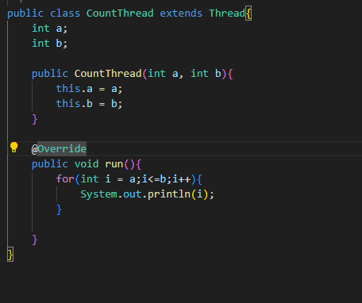  
2. Complete el método __main__ de la clase CountMainThreads para que:
	1. Cree 3 hilos de tipo CountThread, asignándole al primero el intervalo [0..99], al segundo [99..199], y al tercero [200..299].
   	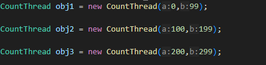
	2. Inicie los tres hilos con 'start()'.
	3. Ejecute y revise la salida por pantalla.
 	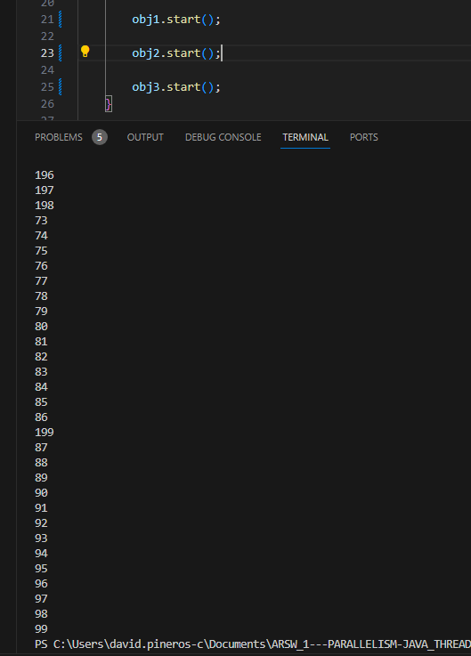
	4. Cambie el incio con 'start()' por 'run()'. Cómo cambia la salida?, por qué?.
    	Ya que el metodo start() esta ejecutando los hilos de forma simultanea, por lo que se estan "cruzando" la impresion de los numeros, esto debido a que cuando usamos este metodo se crea el hilo y no espera la ejecucion "completa" de este hilo, sino que ejecuta la siguiente linea de codigo, mientras que el metodo run () se esta sobreescribiendo con la etiqueta @Override, esto nos permite que se ejecute en orden los hilos ya que se espera a que acabe el primero, para ejecutar el siguiente.
 	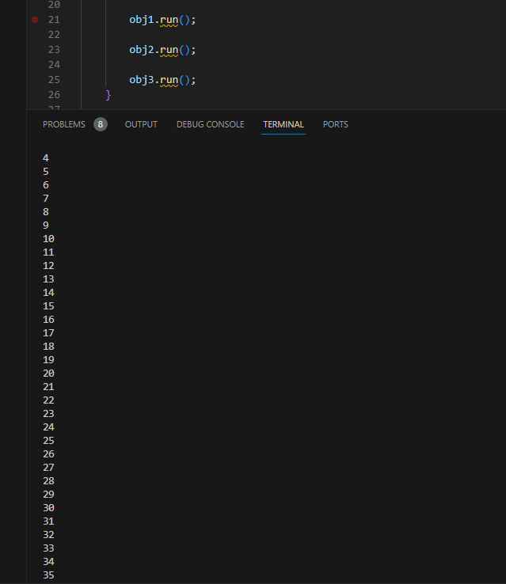

**Parte II - Ejercicio Black List Search**

Para un software de vigilancia automática de seguridad informática se está desarrollando un componente encargado de validar las direcciones IP en varios miles de listas negras (de host maliciosos) conocidas, y reportar aquellas que existan en al menos cinco de dichas listas. 

Dicho componente está diseñado de acuerdo con el siguiente diagrama, donde:

- HostBlackListsDataSourceFacade es una clase que ofrece una 'fachada' para realizar consultas en cualquiera de las N listas negras registradas (método 'isInBlacklistServer'), y que permite también hacer un reporte a una base de datos local de cuando una dirección IP se considera peligrosa. Esta clase NO ES MODIFICABLE, pero se sabe que es 'Thread-Safe'.

- HostBlackListsValidator es una clase que ofrece el método 'checkHost', el cual, a través de la clase 'HostBlackListDataSourceFacade', valida en cada una de las listas negras un host determinado. En dicho método está considerada la política de que al encontrarse un HOST en al menos cinco listas negras, el mismo será registrado como 'no confiable', o como 'confiable' en caso contrario. Adicionalmente, retornará la lista de los números de las 'listas negras' en donde se encontró registrado el HOST.

Al usarse el módulo, la evidencia de que se hizo el registro como 'confiable' o 'no confiable' se dá por lo mensajes de LOGs:

INFO: HOST 205.24.34.55 Reported as trustworthy

INFO: HOST 205.24.34.55 Reported as NOT trustworthy

Al programa de prueba provisto (Main), le toma sólo algunos segundos análizar y reportar la dirección provista (200.24.34.55), ya que la misma está registrada más de cinco veces en los primeros servidores, por lo que no requiere recorrerlos todos. Sin embargo, hacer la búsqueda en casos donde NO hay reportes, o donde los mismos están dispersos en las miles de listas negras, toma bastante tiempo.

Éste, como cualquier método de búsqueda, puede verse como un problema [vergonzosamente paralelo](https://en.wikipedia.org/wiki/Embarrassingly_parallel), ya que no existen dependencias entre una partición del problema y otra.

Para 'refactorizar' este código, y hacer que explote la capacidad multi-núcleo de la CPU del equipo, realice lo siguiente:

1. Cree una clase de tipo Thread que represente el ciclo de vida de un hilo que haga la búsqueda de un segmento del conjunto de servidores disponibles. Agregue a dicha clase un método que permita 'preguntarle' a las instancias del mismo (los hilos) cuantas ocurrencias de servidores maliciosos ha encontrado o encontró.

    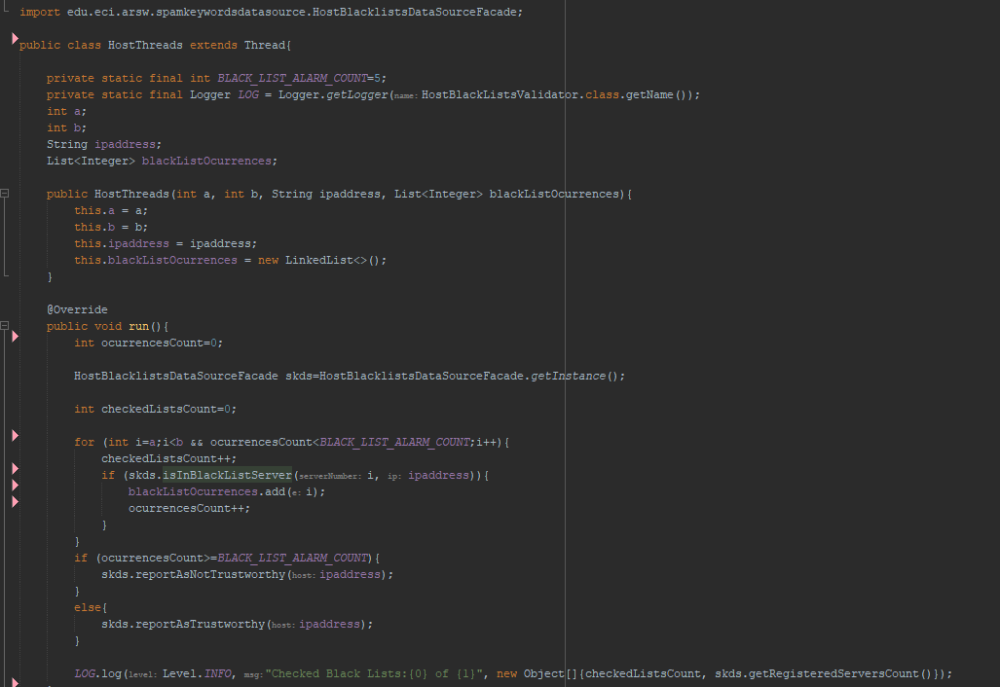 

2. Agregue al método 'checkHost' un parámetro entero N, correspondiente al número de hilos entre los que se va a realizar la búsqueda (recuerde tener en cuenta si N es par o impar!). Modifique el código de este método para que divida el espacio de búsqueda entre las N partes indicadas, y paralelice la búsqueda a través de N hilos. Haga que dicha función espere hasta que los N hilos terminen de resolver su respectivo sub-problema, agregue las ocurrencias encontradas por cada hilo a la lista que retorna el método, y entonces calcule (sumando el total de ocurrencuas encontradas por cada hilo) si el número de ocurrencias es mayor o igual a _BLACK_LIST_ALARM_COUNT_. Si se da este caso, al final se DEBE reportar el host como confiable o no confiable, y mostrar el listado con los números de las listas negras respectivas. Para lograr este comportamiento de 'espera' revise el método [join](https://docs.oracle.com/javase/tutorial/essential/concurrency/join.html) del API de concurrencia de Java. Tenga también en cuenta:

	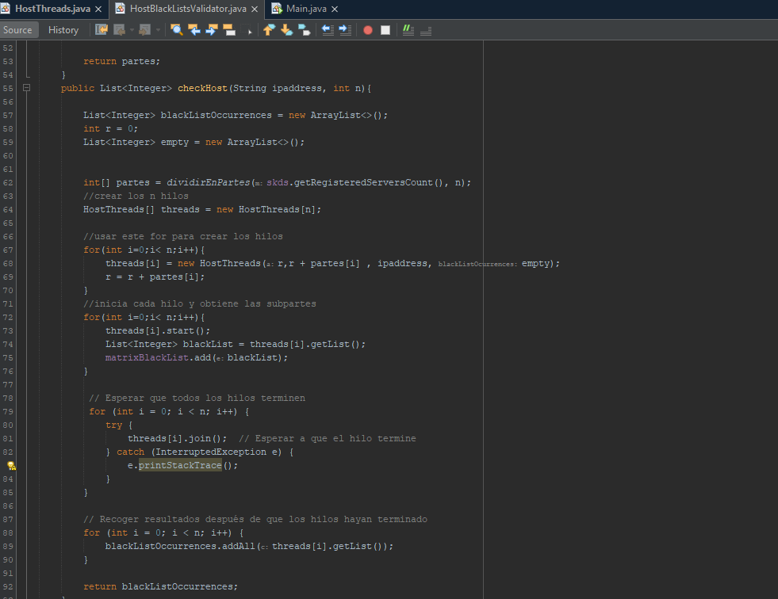 
 
	* Dentro del método checkHost Se debe mantener el LOG que informa, antes de retornar el resultado, el número de listas negras revisadas VS. el número de listas negras total (línea 60). Se debe garantizar que dicha información sea verídica bajo el nuevo esquema de procesamiento en paralelo planteado.

	* Se sabe que el HOST 202.24.34.55 está reportado en listas negras de una forma más dispersa, y que el host 212.24.24.55 NO está en ninguna lista negra.

**Parte II.I Para discutir la próxima clase (NO para implementar aún)**

La estrategia de paralelismo antes implementada es ineficiente en ciertos casos, pues la búsqueda se sigue realizando aún cuando los N hilos (en su conjunto) ya hayan encontrado el número mínimo de ocurrencias requeridas para reportar al servidor como malicioso. Cómo se podría modificar la implementación para minimizar el número de consultas en estos casos?, qué elemento nuevo traería esto al problema?

**Parte III - Evaluación de Desempeño**

A partir de lo anterior, implemente la siguiente secuencia de experimentos para realizar las validación de direcciones IP dispersas (por ejemplo 202.24.34.55), tomando los tiempos de ejecución de los mismos (asegúrese de hacerlos en la misma máquina):

1. Un solo hilo.
   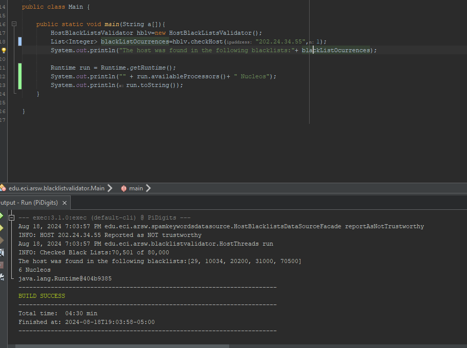 
2. Tantos hilos como núcleos de procesamiento (haga que el programa determine esto haciendo uso del [API Runtime](https://docs.oracle.com/javase/7/docs/api/java/lang/Runtime.html)).
   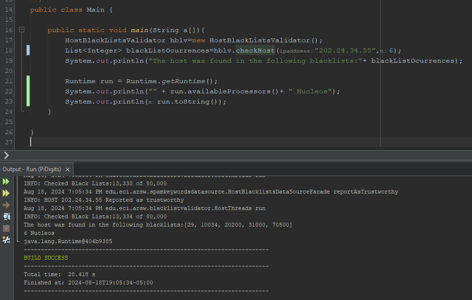 
3. Tantos hilos como el doble de núcleos de procesamiento.
   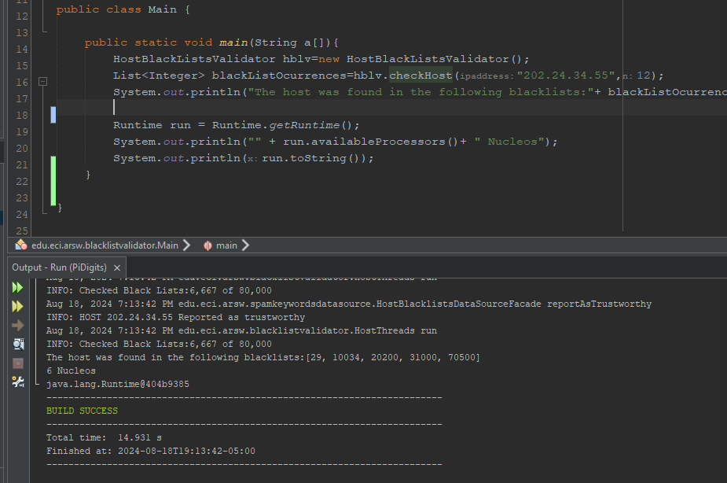 
4. 50 hilos.
   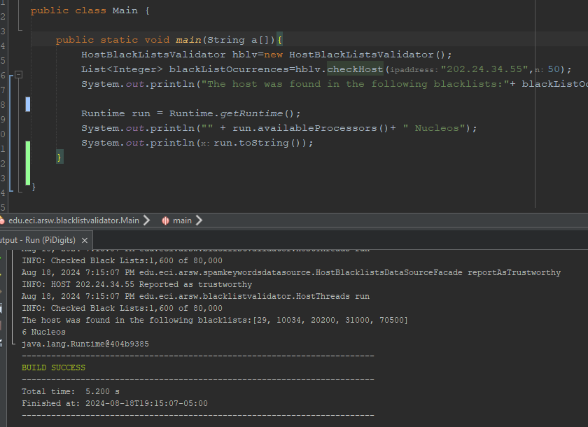 
5. 100 hilos.
   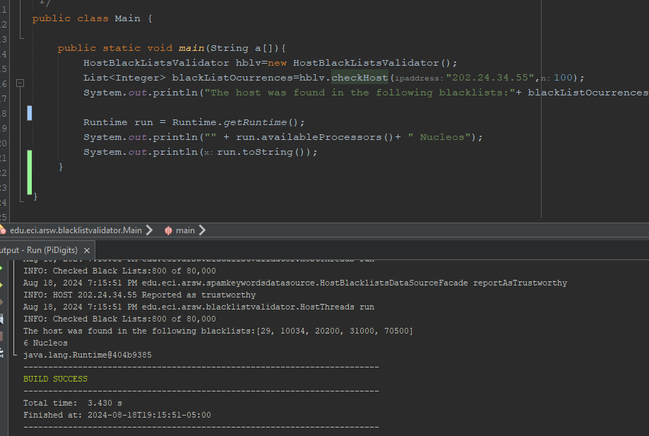 

Al iniciar el programa ejecute el monitor jVisualVM, y a medida que corran las pruebas, revise y anote el consumo de CPU y de memoria en cada caso. 

Con lo anterior, y con los tiempos de ejecución dados, haga una gráfica de tiempo de solución vs. número de hilos. Analice y plantee hipótesis con su compañero para las siguientes preguntas (puede tener en cuenta lo reportado por jVisualVM):

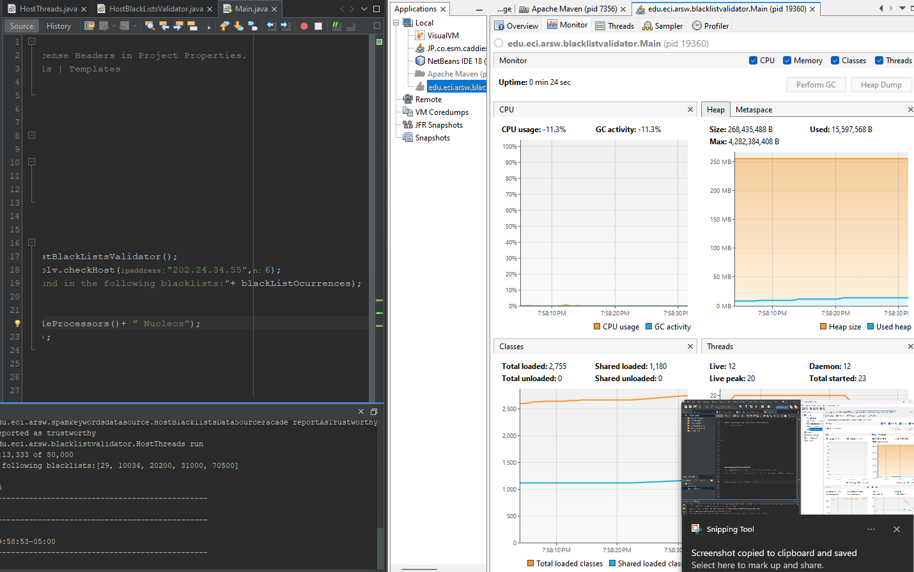 

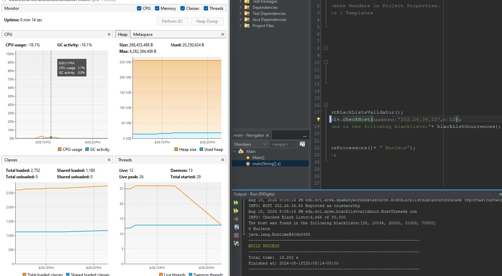 

Como se muestra en las capturas anteriores, el programa tardó entre 28 y 30 segundos en procesar con 6 hilos, mientras que con 12 hilos solo tomó entre 16 y 14 segundos. Además, se puede observar que la duración de los hilos en la prueba con 6 hilos es menor en comparación con la de 12 hilos.

**Parte IV - Ejercicio Black List Search**

1. Según la [ley de Amdahls](https://www.pugetsystems.com/labs/articles/Estimating-CPU-Performance-using-Amdahls-Law-619/#WhatisAmdahlsLaw?):

	, donde _S(n)_ es el mejoramiento teórico del desempeño, _P_ la fracción paralelizable del algoritmo, y _n_ el número de hilos, a mayor _n_, mayor debería ser dicha mejora. Por qué el mejor desempeño no se logra con los 500 hilos?, cómo se compara este desempeño cuando se usan 200?.

- El procesador puede ejecutar varios hilos simultáneamente, pero no en exceso, ya que estos hilos pueden quedar en cola o alternarse entre sí. Según la Ley de Amdahl, si una parte significativa del programa no es paralelizable, añadir más hilos no mejorará sustancialmente el rendimiento. De hecho, tener 200 hilos en ejecución puede ser más eficiente que tener 500, porque el poder de cómputo del procesador tiene un límite en la cantidad de hilos que puede manejar simultáneamente. Además, a medida que aumentan los hilos, la sobrecarga de sincronización y la gestión de los recursos puede reducir las ganancias de rendimiento esperadas.
- Esto depende del factor P, que representa la cantidad de hilos que se pueden paralelizar al mismo tiempo. Por lo tanto, existe un límite; cuando se excede el número de hilos que el procesador puede paralelizar, estos hilos adicionales se colocan en cola, lo que genera un peor desempeño. Esto indica que el punto óptimo podría estar entre 200 y 500 hilos, y al usar 500 hilos, algunos de ellos se quedan en cola, lo que afecta negativamente el rendimiento.
 Por ejemplo, podemos observar un ejemplo usando nuestra implementación. Realizamos una prueba con 200 hilos, y el tiempo de ejecución fue un poco más de dos segundos. Teóricamente, al aumentar a 80,000 hilos, debería haber sido más rápido, pero debido a las limitaciones ya mencionadas, el tiempo de ejecución fue mucho mayor que con un número menor de hilos. Esto confirma que agregar más hilos no siempre mejora el rendimiento, ya que la sobrecarga de gestión y las limitaciones del hardware afectan la eficiencia.

200 Hilos:
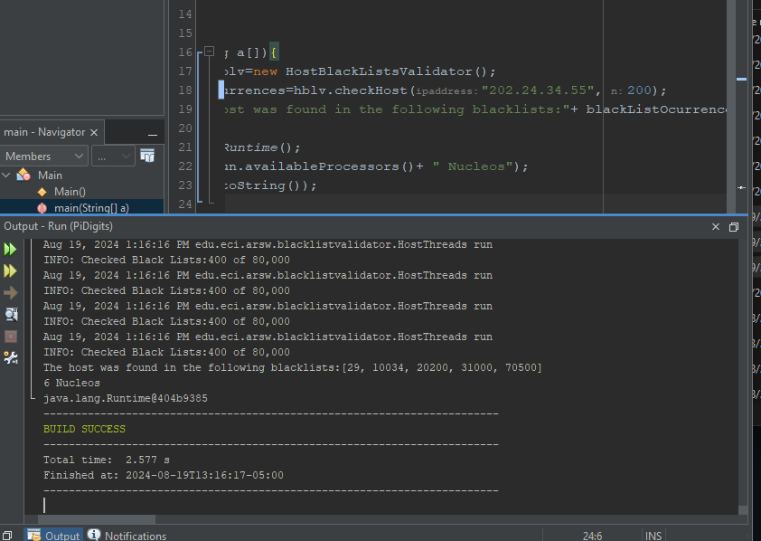 
80000 Hilos:
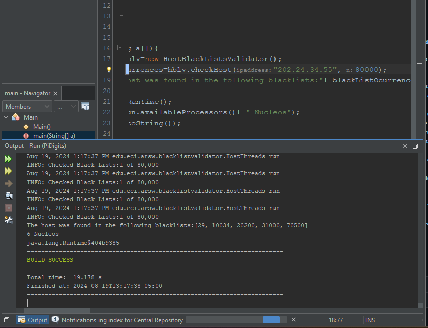 

2. Cómo se comporta la solución usando tantos hilos de procesamiento como núcleos comparado con el resultado de usar el doble de éste?.

   Como se observo en las pruebas graficas usando el monitor de JVisualVM, mejora el tiempo y el rendimiento del programa, esto debido a que estamos aprovechando de una mejor manera los recursos del procesador, creando mas hilos de trabajo, pero sin llegar a saturar y creando cuellos de botellas que puedan afectar el rendimiento del CPU.

3. De acuerdo con lo anterior, si para este problema en lugar de 100 hilos en una sola CPU se pudiera usar 1 hilo en cada una de 100 máquinas hipotéticas, la ley de Amdahls se aplicaría mejor?. Si en lugar de esto se usaran c hilos en 100/c máquinas distribuidas (siendo c es el número de núcleos de dichas máquinas), se mejoraría?. Explique su respuesta.
   
   Como ya se mencionó anteriormente, se puede afirmar que no habria una mejora o un mayor desempeño al momento de ejecutar el programa, por el contrario se estarian consumiendo muchos mas recursos fisicos y no necesariamente esto seria mejor debido a que se estaria sobrecargando el procesador y generarando colas que pueden llegar a reducir la eficiencia.

